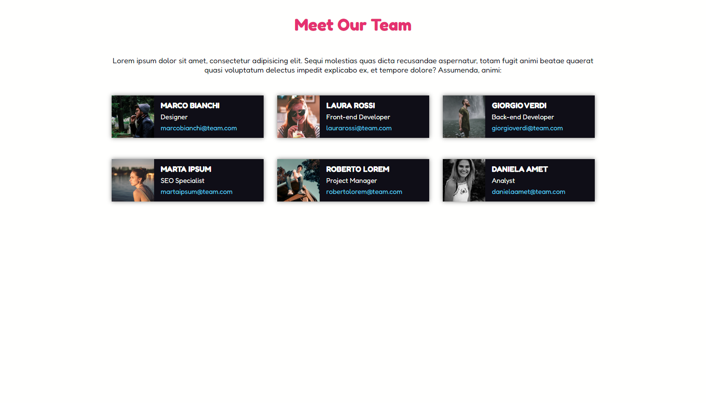

# Floating cards

Questo progetto è un esempio di come creare un micro layout contenente 6 cards rappresentanti un ipotetico team. L'obiettivo di questo esercizio è quello di sviluppare una struttura base per la sezione, definendo le colonne e le cards utilizzando blocchi colorati. Successivamente, è possibile aggiungere testi, immagini e altri dettagli per personalizzare il layout.

## Layout di riferimento



## Struttura

```bash
.
├── index.html
│
├── css/
│   ├── style.css
│
├── img/
│   ├── male1.png
│   ├── female1.png
│   ├── male2.png
│   ├── female2.png
│   ├── male3.png
│   ├── female3.png
│   ├── screen.png
│
├── fonts
│   ├── redoka
│
└── README.md
```
